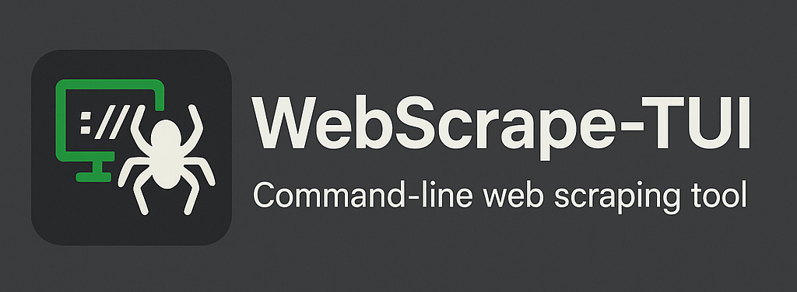

# WebScrape-TUI v2.0.0

[](https://opensource.org/licenses/MIT)
[](https://www.python.org/downloads/)
[](https://textual.textualize.io/)
[](https://github.com/doublegate/WebScrape-TUI/releases)

A comprehensive Python-based Text User Interface (TUI) application for web scraping, data management, and AI-powered content analysis built with the modern Textual framework.



## 🚀 Features

### 👥 Multi-User Authentication & Access Control (v2.0.0)

- **User Authentication**: Secure login system with bcrypt password hashing
- **Session Management**: 24-hour session tokens with automatic expiration
- **Role-Based Access Control (RBAC)**: Admin, User, and Viewer roles with hierarchical permissions
- **User Profile Management**: View and edit user profiles, change passwords (Ctrl+U)
- **User Administration**: Admin-only user management interface (Ctrl+Alt+U)
- **Data Ownership Tracking**: All articles and scrapers tagged with creator user_id
- **Secure Session Handling**: Cryptographically secure session tokens (256-bit)
- **Database Migration**: Automatic migration from v1.x with backup creation
- **Default Admin Account**: Initial admin user (username: admin, password: Ch4ng3M3)

### 🔒 Data Isolation & Sharing (v2.0.0 Phase 3)

- **Data Privacy**: Users see only their own articles (admins see all)
- **Scraper Isolation**: Users see own scrapers + shared scrapers
- **Sharing Toggle**: Share scraper profiles with all users via checkbox
- **Visual Indicators**: [P] for preinstalled, [S] for shared scrapers
- **Permission Enforcement**: Users can only edit/delete own scrapers (admin override)
- **Filter Presets**: Save and load filter configurations (Ctrl+Shift+F/S)
- **Ownership Tracking**: All content tagged with creator user_id

### 🖥️ Interactive Terminal Interface

- **Modern TUI**: Built with Textual framework for responsive terminal-based interaction
- **Clean Main Interface**: Full-screen DataTable for optimal article viewing and navigation
- **Dedicated Filter Screen**: Ctrl+F opens comprehensive filter modal dialog
- **Modal Dialogs**: Intuitive popup windows for user input and data display
- **Real-time Tables**: Dynamic data tables with live sorting and visual selection indicators
- **Intelligent Row Selection**: Spacebar selection with asterisk indicators (*ID) and cursor fallback
- **Sequential Modal Workflows**: Callback-based dialog chains for complex interactions
- **Status Indicators**: Visual feedback for operations and progress tracking
- **Keyboard Navigation**: Full keyboard support with intuitive shortcuts

### 🌐 Advanced Web Scraping

- **Pre-configured Profiles**: 10+ built-in scraper profiles for popular websites
- **Custom Scrapers**: Create your own scraper profiles with URL patterns and CSS selectors
- **Robust Parsing**: BeautifulSoup4-powered HTML parsing with error handling
- **Archive Support**: Wayback Machine integration for historical content
- **Retry Mechanisms**: Automatic retry logic for failed requests

### 🗄️ Data Management

- **SQLite Database**: Persistent storage with normalized schema design
- **Filter Presets** (v1.4.0): Save and load common filter combinations with one click
- **Advanced Filtering** (v1.3.0): Regex support, date ranges, AND/OR tag logic
- **Bulk Selection** (v1.2.0): Multi-select articles with visual [✓] indicators
- **Select All/Deselect All** (v1.2.0): Ctrl+A/Ctrl+D for quick bulk operations
- **Bulk Delete** (v1.2.0): Delete multiple articles at once with confirmation
- **Visual Row Selection**: Spacebar and mouse click selection with indicators
- **Scraper Profile Context**: Visual indicators showing current scraper profile in status bar and modals
- **Sequential Modal Dialogs**: Callback-based workflows preventing worker context errors
- **Flexible Sorting**: 9 different sorting options with proper SQL table aliases
- **Tag System**: Comma-separated tagging for article categorization with AND/OR logic (v1.3.0)
- **CSV Export**: Export filtered data to CSV format
- **JSON Export** (v1.2.0): Export to structured JSON with metadata and nested tags
- **Transaction Safety**: Context managers ensure data integrity

### 🤖 AI Integration

- **Multiple AI Providers** (v1.3.0): Google Gemini, OpenAI GPT, Anthropic Claude support
- **Provider Selection** (v1.3.0): Easy switching between AI providers (Ctrl+P)
- **Custom Templates** (v1.3.0): 7 built-in + user-defined summarization templates
- **Template Variables** (v1.3.0): Dynamic {title}, {content}, {url}, {date} substitution
- **Multiple Summarization Styles**: Overview, bullets, ELI5, academic, executive, technical, news
- **Sentiment Analysis**: Confidence-scored sentiment detection across all providers
- **AI Auto-Tagging** (v1.8.0): Automatic tag generation using AI content analysis (Ctrl+Shift+T)
- **Named Entity Recognition** (v1.8.0): Extract people, organizations, locations, dates with spaCy (Ctrl+Shift+E)
- **Keyword Extraction** (v1.8.0): TF-IDF-based keyword extraction with title boosting (Ctrl+Shift+K)
- **Content Similarity** (v1.8.0): Find similar articles using semantic embeddings (Ctrl+Shift+R)
- **Multi-Level Summarization** (v1.8.0): Brief, detailed, and comprehensive summary levels
- **Topic Modeling** (v1.9.0): LDA and NMF algorithms for discovering content themes
- **Question Answering** (v1.9.0): Interactive Q&A system with multi-article synthesis
- **Entity Relationships** (v1.9.0): Knowledge graph construction from extracted entities
- **Duplicate Detection** (v1.9.0): Fuzzy matching to find similar/duplicate articles
- **Summary Quality Metrics** (v1.9.0): ROUGE scores and coherence evaluation
- **Article Clustering** (v1.9.0): Group similar articles by content similarity
- **Async Processing**: Non-blocking AI operations to maintain UI responsiveness
- **Optimized API Calls**: Efficient request handling and error management
- **Configurable API Keys**: Easy setup for multiple AI providers

### 🔧 Configuration & Performance

- **YAML Configuration** (v1.4.0): Human-readable config files with deep merge support
- **Settings Modal** (v1.4.0): In-app configuration editor (Ctrl+G)
- **Optimized Codebase**: Comprehensive formatting and performance improvements
- **Memory Efficiency**: Removed unused imports and optimized resource usage
- **Enhanced Error Handling**: Robust exception management and logging
- **Clean Architecture**: PEP 8 compliant code structure
- **Database Optimization**: Efficient SQL queries and connection management
- **Async Operations**: Non-blocking workers for responsive UI

### 📖 Content Management

- **Full-text Reading**: Complete article fetching and display
- **Markdown Rendering**: Enhanced readability with formatted text
- **Article Preview**: Quick preview before full content view
- **Content Deduplication**: Smart handling of duplicate articles

### 📊 Data Visualization & Analytics (v1.6.0)

- **Comprehensive Statistics**: Real-time analytics dashboard accessible via Ctrl+Shift+V
- **Sentiment Analysis Visualization**: Pie chart showing positive/negative/neutral sentiment distribution
- **Timeline Charts**: Line graph of articles scraped over last 30 days with trend analysis
- **Top Sources Analysis**: Horizontal bar chart showing top 10 most-scraped sources
- **Tag Analytics**: Tag cloud data with usage frequency and top 20 tags display
- **Professional Chart Export**: PNG charts with timestamps for reports and presentations
- **Statistics Reports**: Comprehensive text reports with all metrics in formatted sections
- **Real-time Data**: All analytics reflect current database state instantly
- **Export Capabilities**: One-click export of all charts and detailed text reports

### 📈 Enhanced Export & Reporting (v1.7.0)

- **Excel (XLSX) Export**: Professional spreadsheets with multiple sheets and formatting
  - Articles sheet with auto-sized columns and styled headers
  - Statistics sheet with comprehensive metrics summary
  - Timeline sheet with 30-day scraping activity data
  - Embedded filter metadata for export traceability
  - Support for 1,000,000+ row capacity
- **PDF Report Generation**: Publication-ready PDF reports with professional layouts
  - Executive summary with key statistics
  - Sentiment distribution charts embedded
  - Timeline visualization with trend analysis
  - Top sources and tags analysis sections
  - Three export templates: Standard, Executive, Detailed
  - Custom branding and header support
- **Word Cloud Visualization**: Tag frequency visualization as word clouds
  - Size-based frequency representation
  - Customizable color schemes and layouts
  - PNG export with high resolution (300 DPI)
  - Interactive tag filtering integration
- **Sentiment Scatter Plot**: Advanced sentiment analysis visualization
  - Scatter plot showing sentiment scores over time
  - Color-coded positive/negative/neutral data points
  - Trend line overlay for sentiment patterns
  - Date range filtering support

### 📅 Scheduled Scraping & Automation (v1.5.0)

- **Background Scheduler**: APScheduler-powered automated scraping system
- **Multiple Schedule Types**: Hourly, daily, weekly, interval, and cron-style scheduling
- **Schedule Management**: Create, enable/disable, update, and delete schedules via Ctrl+Shift+A
- **Execution Tracking**: Monitor last run, next run, run count, and success/failure status
- **Error Logging**: Comprehensive error tracking for failed scheduled scrapes
- **Profile Integration**: Schedule any saved scraper profile for automatic execution

## 📋 Table of Contents

- [Installation](#-installation)
- [Quick Start](#-quick-start)
- [Configuration](#-configuration)
- [Usage Guide](#-usage-guide)
- [Features Deep Dive](#-features-deep-dive)
- [API Integration](#-api-integration)
- [Database Schema](#-database-schema)
- [Keyboard Shortcuts](#-keyboard-shortcuts)
- [Documentation](#-documentation)
- [Troubleshooting](#-troubleshooting)
- [Contributing](#-contributing)
- [Changelog](#-changelog)
- [License](#-license)

## 🛠️ Installation

### Prerequisites

- **Python 3.8 to 3.12** (Python 3.10-3.12 recommended)
  - **Python 3.13**: Currently not fully supported (see installation workarounds below)
  - **gensim incompatibility**: Topic modeling features (v1.9.0) require Python 3.12 or earlier
- **Terminal with Unicode support** for proper display
- **Internet connection** for web scraping

### Method 1: Clone and Install

```bash
# Clone the repository
git clone https://github.com/doublegate/WebScrape-TUI.git
cd WebScrape-TUI

# Install dependencies
pip install -r requirements.txt

# Run the application
python scrapetui.py
```

### Method 2: Manual Dependencies

```bash
# Core dependencies (required)
pip install textual requests beautifulsoup4 lxml PyYAML APScheduler

# Multi-user authentication (v2.0.0+)
pip install bcrypt

# Data visualization and export (v1.6.0+)
pip install matplotlib pandas openpyxl reportlab wordcloud

# Advanced AI features (v1.8.0+)
pip install spacy sentence-transformers nltk scikit-learn scipy

# Topic modeling and analysis (v1.9.0+)
pip install gensim networkx rouge-score fuzzywuzzy python-Levenshtein

# Download spaCy language model (required for entity recognition)
python -m spacy download en_core_web_sm

# Run the application
python scrapetui.py
```

### Method 3: Installation Scripts (Platform-Specific)

WebScrape-TUI provides automated installation scripts for different platforms and Python versions.

#### Arch Linux + Fish Shell

If you're using Arch Linux with Fish shell, use the provided installation guide:

```fish
# See detailed instructions
cat INSTALL-ARCH.md

# Quick install with Python 3.12 (recommended)
yay -S python312
python3.12 -m venv venv-312
source venv-312/bin/activate.fish
pip install -r requirements.txt
python -m spacy download en_core_web_sm
```

#### Python 3.13 Users (Any Platform)

Python 3.13 is not yet fully supported due to gensim compatibility issues. Choose one option:

**Option A: Install without topic modeling** (Quick, 99% features work):
```bash
# Run the provided script
./install-python313.sh

# Or manually
grep -v "^gensim" requirements.txt | pip install -r /dev/stdin
```

**Option B: Use Python 3.12** (Recommended, 100% features work):
```bash
# Install Python 3.12 (method varies by OS)
# - Arch: yay -S python312
# - Ubuntu: sudo add-apt-repository ppa:deadsnakes/ppa && sudo apt install python3.12
# - macOS: brew install python@3.12

# Create venv with Python 3.12
python3.12 -m venv venv-312
source venv-312/bin/activate
pip install -r requirements.txt
python -m spacy download en_core_web_sm
```

See [INSTALL-ARCH.md](INSTALL-ARCH.md) for detailed platform-specific instructions.

### Dependencies

- **textual** (>=0.38.0) - Modern Python TUI framework
- **requests** (>=2.28.0) - HTTP library for web requests
- **beautifulsoup4** (>=4.11.0) - HTML parsing library
- **lxml** (>=4.9.0) - Fast XML/HTML parser backend
- **bcrypt** (>=4.0.0) - Secure password hashing for multi-user authentication (v2.0.0)
- **PyYAML** (>=6.0.0) - YAML configuration file parser (v1.4.0)
- **APScheduler** (>=3.10.0) - Background task scheduling for automation (v1.5.0)
- **matplotlib** (>=3.7.0) - Chart generation and data visualization (v1.6.0)
- **pandas** (>=2.0.0) - Data analysis and statistics (v1.6.0)
- **openpyxl** (>=3.1.0) - Excel (XLSX) file creation and formatting (v1.7.0)
- **reportlab** (>=4.0.0) - PDF report generation and layout (v1.7.0)
- **wordcloud** (>=1.9.0) - Word cloud visualization for tag frequency (v1.7.0)
- **spacy** (>=3.7.0) - Natural language processing for entity recognition (v1.8.0)
- **en_core_web_sm** (>=3.7.0) - English language model for spaCy (v1.8.0)
- **sentence-transformers** (>=2.2.0) - Semantic embeddings for similarity matching (v1.8.0)
- **nltk** (>=3.8.0) - Natural language toolkit for keyword extraction (v1.8.0)
- **scikit-learn** (>=1.3.0) - TF-IDF vectorization for keywords (v1.8.0)
- **scipy** (>=1.11.0) - Scientific computing for cosine distance (v1.8.0)
- **gensim** (>=4.3.0) - LDA and NMF topic modeling algorithms (v1.9.0)
  - ⚠️ **Python 3.13 incompatible** - requires Python 3.12 or earlier
- **networkx** (>=3.0) - Knowledge graph construction and entity relationships (v1.9.0)
- **rouge-score** (>=0.1.2) - ROUGE metrics for summary quality evaluation (v1.9.0)
- **fuzzywuzzy** (>=0.18.0) - Fuzzy string matching for duplicate detection (v1.9.0)
- **python-Levenshtein** (>=0.20.0) - Fast string distance calculations (v1.9.0)

## 🚀 Quick Start

1. **Launch the application:**
   ```bash
   python scrapetui.py
   ```

2. **First time setup (v2.0.0+):**
   - The application creates a SQLite database automatically
   - CSS styling file is generated if not present
   - **Login with default admin credentials:**
     - Username: `admin`
     - Password: `Ch4ng3M3`
   - **Important**: Change the admin password immediately after first login (Ctrl+U → Change Password)
   - Create additional user accounts if needed (Ctrl+Alt+U)

3. **Basic scraping:**
   - Press `Ctrl+S` to open the scraping dialog
   - Enter a URL and CSS selector
   - Set the number of articles to scrape
   - Click "Start Scraping" to begin

4. **Using pre-configured scrapers:**
   - Press `S` to open saved scrapers
   - Select from 10+ pre-installed profiles
   - Execute scraper or customize for your needs

## ⚙️ Configuration

### Configuration File (v1.4.0)

WebScrape-TUI now uses a YAML configuration file (`config.yaml`) for managing application settings. The configuration file is created automatically on first run with sensible defaults.

**Configuration Sections:**

```yaml
ai:
  default_provider: 'gemini'  # Default AI provider (gemini/openai/claude)
  default_model: null         # Optional specific model selection

export:
  default_format: 'csv'       # Default export format (csv/json)
  output_directory: '.'       # Export file destination

ui:
  theme: 'default'            # UI theme
  table_columns: [...]        # Visible table columns

database:
  auto_vacuum: false          # Automatic database optimization
  backup_on_exit: false       # Backup database on application exit

logging:
  level: 'INFO'               # Logging verbosity (DEBUG/INFO/WARNING/ERROR)
  max_file_size_mb: 10        # Maximum log file size
```

**In-App Configuration:**
- Press `Ctrl+G` to open the Settings modal
- Edit settings through the interactive interface
- Changes are saved to `config.yaml` automatically

### API Keys Setup (v1.3.0)

For AI features, configure your API keys for supported providers using environment variables:

1. **Copy the environment template:**
   ```bash
   cp .env.example .env
   ```

2. **Edit the .env file with your API keys:**
   ```bash
   # Choose one or more AI providers (at least one required for AI features)

   # Google Gemini (default provider)
   GEMINI_API_KEY=your_gemini_api_key_here

   # OpenAI GPT (optional)
   OPENAI_API_KEY=your_openai_api_key_here

   # Anthropic Claude (optional)
   CLAUDE_API_KEY=your_claude_api_key_here
   ```

3. **Get your API keys:**
   - **Google Gemini**: Visit [Google AI Studio](https://makersuite.google.com/app/apikey)
   - **OpenAI**: Visit [OpenAI API Keys](https://platform.openai.com/api-keys)
   - **Anthropic Claude**: Visit [Anthropic Console](https://console.anthropic.com/)

4. **Select provider in-app:**
   - Press `Ctrl+P` to open provider selection modal
   - Choose from configured providers
   - Provider selection persists across sessions

**Important:** The `.env` file is automatically ignored by Git to keep your API keys secure.

### Environment Configuration

All configuration is managed through the `.env` file:

| Variable | Description | Default |
|:---------|:------------|:--------|
| `GEMINI_API_KEY` | Google Gemini API key for AI features | *(empty)* |
| `OPENAI_API_KEY` | OpenAI GPT API key for AI features (v1.3.0) | *(empty)* |
| `CLAUDE_API_KEY` | Anthropic Claude API key for AI features (v1.3.0) | *(empty)* |
| `DATABASE_PATH` | Custom database file location | `scraped_data_tui_v1.0.db` |
| `LOG_FILE_PATH` | Custom log file location | `scraper_tui_v1.0.log` |
| `LOG_LEVEL` | Logging verbosity level | `DEBUG` |

### Database Location

The SQLite database is stored as `scraped_data_tui_v1.0.db` in the application directory (configurable via `.env`).

### Logging

Logs are written to `scraper_tui_v1.0.log` with configurable levels (configurable via `.env`).

### Styling

Customize the appearance by editing `web_scraper_tui_v1.0.tcss`.

## 📖 Usage Guide

### Authentication & User Management (v2.0.0)

**First Login:**
- Launch the application with `python scrapetui.py`
- Login with default admin credentials (username: `admin`, password: `Ch4ng3M3`)
- **Change password immediately** via Ctrl+U → Change Password

**User Management (Admin Only):**
- Press `Ctrl+Alt+U` to open User Management
- Create new users with specific roles:
  - **Admin**: Full access to all data and user management
  - **User**: Create and manage own articles and scrapers
  - **Viewer**: Read-only access to shared content
- Edit existing users (email, role)
- Toggle user active/inactive status
- View all user accounts and login history

**User Profile:**
- Press `Ctrl+U` to view/edit your profile
- Update email address
- Change password
- View account details (created date, last login)

**Session Management:**
- Sessions expire after 24 hours
- Press `Ctrl+Shift+L` to logout
- Automatic session validation on all operations

### Starting Your First Scrape

1. **Manual URL Scraping:**
   - Press `Ctrl+S` or use the menu
   - Enter target URL
   - Specify CSS selector (e.g., `article`, `.post-title`, `#content`)
   - Set article limit
   - Add optional tags
   - Start scraping

2. **Using Scraper Profiles:**
   - Press `S` for saved scrapers
   - Choose from pre-installed profiles:
     - Hacker News
     - Reddit
     - Medium
     - Dev.to
     - And many more...
   - Execute or customize as needed

### Managing Your Data

**Filtering Articles (v1.4.0 Enhanced):**
- Press `Ctrl+F` to open the advanced filter dialog
- **Regex Support**: Toggle regex mode for title/URL pattern matching
- **Date Range**: Filter by from/to dates instead of single date
- **Tag Logic**: Choose AND (all tags) or OR (any tag) matching
- **Filter Presets** (v1.4.0): Save and load common filter combinations
  - Press `Ctrl+Shift+S` to save current filters as a preset
  - Press `Ctrl+Shift+F` to load or delete saved presets
  - Presets store all filter parameters (title, URL, dates, tags, sentiment, regex, logic)
- Use "Clear All" to reset all filters quickly
- Filters preserve current values when reopening
- Apply filters to return to main screen with filtered results

**Sorting Options:**
- Date (newest/oldest first)
- Title (A-Z/Z-A)
- URL (A-Z/Z-A)
- Sentiment (positive/negative first)

**Exporting Data:**
- Press `Ctrl+E` to export current view to CSV
- Press `Ctrl+J` to export to JSON format (v1.2.0)
- Press `Ctrl+Shift+X` to export to Excel (XLSX) with formatting (v1.7.0)
- Press `Ctrl+Shift+P` to generate PDF report with charts (v1.7.0)
- Press `Ctrl+Shift+W` to export word cloud visualization (v1.7.0)
- Includes all applied filters in all formats
- Excel export includes multiple sheets and statistics
- PDF reports include charts and executive summaries
- JSON export includes metadata and nested tags
- Preserves column structure and filter information

### Advanced Features

**Tag Management:**
- Press `T` to manage tags
- Add/remove tags from articles
- Use comma-separated format
- Search and filter by tags

**Article Reading:**
- Press `Enter` on any article to read full content
- Markdown formatting for better readability
- Navigate with arrow keys and scroll

**AI Analysis (v1.3.0 Enhanced):**
- Configure one or more AI provider API keys in `.env` file
- **Multiple Providers**: Choose between Gemini, OpenAI GPT, or Claude (Ctrl+P)
- **Custom Templates**: Select from 7 built-in or create your own summarization templates
- **Template Variables**: Use {title}, {content}, {url}, {date} in custom templates
- **Summarization Styles**: Overview, Bullets, ELI5, Academic, Executive, Technical, News
- Sentiment analysis with confidence scores across all providers
- Async processing for performance

## 🔧 Features Deep Dive

### Pre-installed Scraper Profiles (24 Total)

**Popular Tech & News Sites:**
| Website | Profile Name | Description |
|:--------|:-------------|:------------|
| Hacker News | HN Front Page | Latest technology news and discussions |
| Reddit | Reddit Subreddit Posts | Trending posts from subreddits (old.reddit.com) |
| Medium | Medium Articles | Articles from Medium topics and publications |
| Dev.to | Dev.to Articles | Developer articles and tutorials |
| GitHub | GitHub Trending Repos | Trending open-source repositories |
| TechCrunch | TechCrunch News | Startup and technology news |
| Ars Technica | Ars Technica Articles | In-depth technology and science analysis |
| The Verge | The Verge Articles | Consumer technology news and reviews |
| Product Hunt | Product Hunt Products | New product launches and discoveries |
| Lobsters | Lobsters Tech News | Computing-focused link aggregation |

**Specialized Scrapers:**
| Type | Profile Name | Description |
|:-----|:-------------|:------------|
| Wikipedia | Wikipedia Article Text | Paragraph extraction from Wikipedia articles |
| Stack Overflow | StackOverflow Q&A | Questions and answers extraction |
| Academic | Academic Abstract (arXiv) | Research paper abstracts from arXiv.org |
| E-commerce | Product Details (Basic) | Product titles and prices |
| Recipes | Recipe Ingredients | Ingredient lists from recipe sites |
| Forums | Forum Posts (Generic) | Posts and comments from forums |
| Tables | Tech Specs (Simple Table) | Table data extraction |
| Archive | Archived Page (Wayback) | Wayback Machine integration |
| RSS | RSS Feed Parser (Generic) | RSS/Atom feed parsing |
| Documentation | Documentation Pages | ReadTheDocs, GitHub Pages, etc. |
| Blogs | Blog Posts (WordPress) | WordPress blog articles |
| Video | YouTube Video Descriptions | YouTube video metadata |
| News | News Headlines (General) | Headlines from news websites |
| Generic | Generic Article Cleaner | Universal article content extraction |

### Custom Scraper Creation

Create powerful custom scrapers with:

- **URL Patterns**: Support for wildcards and regex
- **CSS Selectors**: Target specific page elements
- **Default Limits**: Set standard article counts
- **Tag Templates**: Pre-populate tags for scraped content
- **Descriptions**: Document scraper purpose and usage

### Database Schema (Updated v1.3.0)

```sql
-- Articles table
CREATE TABLE scraped_data (
    id INTEGER PRIMARY KEY AUTOINCREMENT,
    url TEXT NOT NULL,
    title TEXT NOT NULL,
    link TEXT NOT NULL,
    timestamp TIMESTAMP DEFAULT CURRENT_TIMESTAMP,
    summary TEXT,
    sentiment TEXT
);

-- Tags system
CREATE TABLE tags (
    id INTEGER PRIMARY KEY AUTOINCREMENT,
    name TEXT NOT NULL UNIQUE
);

CREATE TABLE article_tags (
    article_id INTEGER NOT NULL,
    tag_id INTEGER NOT NULL,
    FOREIGN KEY (article_id) REFERENCES scraped_data(id) ON DELETE CASCADE,
    FOREIGN KEY (tag_id) REFERENCES tags(id) ON DELETE CASCADE,
    PRIMARY KEY (article_id, tag_id)
);

-- Scraper profiles
CREATE TABLE saved_scrapers (
    id INTEGER PRIMARY KEY AUTOINCREMENT,
    name TEXT NOT NULL UNIQUE,
    url TEXT NOT NULL,
    selector TEXT NOT NULL,
    default_limit INTEGER DEFAULT 0,
    default_tags_csv TEXT,
    description TEXT,
    is_preinstalled INTEGER DEFAULT 0
);

-- Summarization templates (v1.3.0)
CREATE TABLE summarization_templates (
    id INTEGER PRIMARY KEY AUTOINCREMENT,
    name TEXT NOT NULL UNIQUE,
    template TEXT NOT NULL,
    description TEXT,
    is_builtin INTEGER DEFAULT 0,
    created_at TIMESTAMP DEFAULT CURRENT_TIMESTAMP
);

-- Filter presets (v1.4.0)
CREATE TABLE filter_presets (
    id INTEGER PRIMARY KEY AUTOINCREMENT,
    name TEXT NOT NULL UNIQUE,
    title_filter TEXT,
    url_filter TEXT,
    date_from TEXT,
    date_to TEXT,
    tags_filter TEXT,
    sentiment_filter TEXT,
    use_regex INTEGER DEFAULT 0,
    tags_logic TEXT DEFAULT 'AND',
    created_at TIMESTAMP DEFAULT CURRENT_TIMESTAMP
);
```

## ⌨️ Keyboard Shortcuts & Mouse Support

### Global Shortcuts

| Key | Action |
|:----|:-------|
| `q` / `Ctrl+C` | Quit application |
| `F1` / `Ctrl+H` | Show help dialog |
| `Ctrl+U` | **User Profile** (v2.0.0) |
| `Ctrl+Alt+U` | **User Management (Admin Only)** (v2.0.0) |
| `Ctrl+Shift+L` | **Logout** (v2.0.0) |
| `Ctrl+N` | New scrape dialog |
| `Ctrl+M` | Saved scrapers / Manage profiles |
| `Ctrl+P` | **Select AI Provider** (v1.3.0) |
| `Ctrl+G` | **Settings** (v1.4.0) |
| `Ctrl+Shift+A` | **Manage Schedules** (v1.5.0) |
| `Ctrl+Shift+V` | **View Analytics** (v1.6.0) |
| `Ctrl+Shift+T` | **AI Auto-Tag** (v1.8.0) |
| `Ctrl+Shift+E` | **Extract Entities** (v1.8.0) |
| `Ctrl+Shift+K` | **Extract Keywords** (v1.8.0) |
| `Ctrl+Shift+R` | **Find Similar Articles** (v1.8.0) |
| `Ctrl+Alt+T` | **Topic Modeling** (v1.9.0) |
| `Ctrl+Alt+Q` | **Ask Question** (v1.9.0) |
| `Ctrl+Alt+D` | **Find Duplicates** (v1.9.0) |
| `Ctrl+Alt+L` | **Related Articles** (v1.9.0) |
| `Ctrl+Alt+C` | **Cluster Articles** (v1.9.0) |
| `Ctrl+Alt+H` | **Q&A History** (v1.9.0) |
| `Ctrl+Alt+M` | **Summary Quality** (v1.9.0) |
| `Ctrl+T` | Manage tags for selected article |
| `Ctrl+F` | Open advanced filter dialog |
| `Ctrl+Shift+F` | **Manage Filter Presets** (v1.4.0) |
| `Ctrl+Shift+S` | **Save Current Filters as Preset** (v1.4.0) |
| `Ctrl+E` | Export to CSV |
| `Ctrl+J` | **Export to JSON** (v1.2.0) |
| `Ctrl+Shift+X` | **Export to Excel (XLSX)** (v1.7.0) |
| `Ctrl+Shift+P` | **Export to PDF Report** (v1.7.0) |
| `Ctrl+Shift+W` | **Export Word Cloud** (v1.7.0) |
| `Ctrl+L` | Toggle dark/light theme |
| `Ctrl+S` | Cycle sort order |
| `r` | Refresh data |

### Navigation & Selection

| Input | Action |
|:------|:-------|
| `↑/↓` | Navigate table rows |
| `Space` | Toggle bulk selection (shows [✓] indicator) |
| `Mouse Click` | Select/unselect clicked row (same as Space) |
| `Ctrl+A` | **Select all visible articles** (v1.2.0) |
| `Ctrl+D` | **Deselect all articles** (v1.2.0) |
| `Enter` | View article details |
| `Tab` | Next input field |
| `Shift+Tab` | Previous input field |
| `Esc` | Close dialog/Cancel |

### Data Management

| Key | Action |
|:----|:-------|
| `s` | Summarize selected article |
| `Ctrl+K` | Sentiment analysis for selected |
| `Ctrl+R` | Read full article content |
| `d`/`Del` | Remove selected article |
| `Ctrl+Shift+D` | **Bulk delete selected articles** (v1.2.0) |
| `Ctrl+T` | Manage tags for selected |
| `R` | Refresh view |

## 📚 Documentation

WebScrape-TUI includes comprehensive documentation in the `docs/` directory:

### Core Documentation

- **[Architecture Guide](docs/ARCHITECTURE.md)** - System design, components, data flow, and extension points
- **[Development Guide](docs/DEVELOPMENT.md)** - Setup, workflows, testing, code style, and contribution guidelines
- **[API Documentation](docs/API.md)** - Manager classes, AI providers, database functions, and data structures
- **[Roadmap](docs/ROADMAP.md)** - Future features, milestones, and contribution opportunities
- **[Project Status](docs/PROJECT-STATUS.md)** - Current health, metrics, and progress tracking
- **[Troubleshooting](docs/TROUBLESHOOTING.md)** - Comprehensive problem-solving guide with solutions

### Quick Links

| Need | Document |
|------|----------|
| Understanding the codebase | [docs/ARCHITECTURE.md](docs/ARCHITECTURE.md) |
| Contributing code | [docs/DEVELOPMENT.md](docs/DEVELOPMENT.md) |
| Using APIs programmatically | [docs/API.md](docs/API.md) |
| Solving problems | [docs/TROUBLESHOOTING.md](docs/TROUBLESHOOTING.md) |
| Planning contributions | [docs/ROADMAP.md](docs/ROADMAP.md) |
| Checking project health | [docs/PROJECT-STATUS.md](docs/PROJECT-STATUS.md) |

See [docs/README.md](docs/README.md) for a complete documentation index and reading paths.

## 🔍 Troubleshooting

### Python Version Compatibility

**Python 3.13 Compatibility Issue**

The gensim library (required for v1.9.0 topic modeling features) is not yet compatible with Python 3.13 due to C API changes. You have three options:

**Option 1: Use Python 3.12 (Recommended)**
- Install Python 3.12 alongside Python 3.13
- Create a virtual environment with Python 3.12
- All features work (100% compatibility)
- See [INSTALL-ARCH.md](INSTALL-ARCH.md) for platform-specific instructions

**Option 2: Use Python 3.13 Without Topic Modeling**
- Run `./install-python313.sh` to install 20/21 dependencies
- All features work except topic modeling (Ctrl+Alt+T)
- 99% feature compatibility
- Can upgrade to Python 3.12 later

**Option 3: Wait for gensim 4.4.0+**
- Monitor https://pypi.org/project/gensim/ for updates
- Once Python 3.13 support is added, reinstall gensim

**What Works on Python 3.13**:
- ✅ All v1.0-v1.8 features (scraping, AI, export, analytics, scheduling, visualization)
- ✅ 16/17 v1.9.0 features (Q&A, entity recognition, duplicates, clustering, summary quality, etc.)

**What Doesn't Work on Python 3.13**:
- ❌ Topic Modeling (Ctrl+Alt+T) - LDA/NMF algorithms

**Error Messages You Might See**:

If you try to install on Python 3.13:
```
error: command '/usr/bin/gcc' failed with exit code 1
ERROR: Failed building wheel for gensim
```

**Solution**: Use Python 3.12 or run `./install-python313.sh`

### Common Issues

**1. Application won't start**

```bash
# Check Python version
python --version  # Should be 3.8+

# Install missing dependencies
pip install textual requests beautifulsoup4 lxml

# Check terminal compatibility
echo $TERM  # Should support Unicode
```

**2. Scraping fails**

- Verify URL accessibility in browser
- Check CSS selector validity
- Review website's robots.txt
- Ensure stable internet connection

**3. AI features not working (v1.3.0)**

- Verify at least one AI provider API key is set in `.env` file
- Ensure `.env` file exists (copy from `.env.example`)
- Press `Ctrl+P` to check which providers are configured
- Check API quota and billing:
  - Gemini: [Google AI Studio](https://makersuite.google.com/)
  - OpenAI: [OpenAI Usage](https://platform.openai.com/usage)
  - Claude: [Anthropic Console](https://console.anthropic.com/)
- Review network connectivity
- Validate API key permissions and format

**4. Database errors**

- Check file permissions in application directory
- Ensure sufficient disk space
- Verify SQLite is available
- Review log files for specifics

**5. Display issues**

- Use terminal with Unicode support
- Increase terminal size (minimum 80x24)
- Check color support
- Update terminal emulator

### Performance Optimization

**For large datasets:**

- Use filters to limit displayed data
- Regular database maintenance
- Export and archive old data
- Optimize CSS selectors

**For slow scraping:**

- Reduce concurrent requests
- Implement delays between requests
- Use more specific selectors
- Check target website rate limits

### Debugging

Enable detailed logging:

```python
# In scrapetui.py, modify logging level
logging.basicConfig(level="DEBUG")
```

Log locations:

- **Main log**: `scraper_tui_v1.0.log`
- **Database**: Check for `.db-journal` files
- **Application errors**: Console output

## 🤝 Contributing

We welcome contributions! Please see [CONTRIBUTING.md](CONTRIBUTING.md) for detailed guidelines.

### Quick Contribution Guide

1. **Fork the repository**
2. **Create a feature branch**: `git checkout -b feature/amazing-feature`
3. **Make your changes**: Follow the existing code style
4. **Add tests**: Ensure new features are tested
5. **Update documentation**: Keep README and docs current
6. **Submit a pull request**: Describe your changes clearly

### Development Setup

```bash
# Clone your fork
git clone https://github.com/doublegate/WebScrape-TUI.git
cd WebScrape-TUI

# Create virtual environment
python -m venv venv
source venv/bin/activate  # On Windows: venv\Scripts\activate

# Install dependencies
pip install -r requirements.txt
pip install -r requirements-dev.txt

# Run tests
python -m pytest tests/ -v

# Run tests with coverage
python -m pytest tests/ --cov=scrapetui --cov-report=html

# View coverage report
open htmlcov/index.html  # Or your browser of choice

# Start developing!
python scrapetui.py
```

### Testing

WebScrape-TUI includes a comprehensive test suite with 100+ tests:

**Test Categories:**
- **Database Tests** (14 tests): CRUD operations, schema validation, tag management
- **Scraping Tests** (20 tests): HTML parsing, HTTP requests, error handling
- **Utility Tests** (26 tests): Environment loading, data validation, text processing
- **Bulk Operations Tests** (12 tests): Multi-select, bulk delete, SQL queries (v1.2.0)
- **JSON Export Tests** (14 tests): Format validation, data conversion (v1.2.0)
- **AI Provider Tests** (15 tests): Provider abstraction, template substitution (v1.3.0)
- **Config & Presets Tests** (14 tests): YAML handling, filter presets, deep merge (v1.4.0)

**Running Tests:**
```bash
# Run all tests
pytest tests/

# Run specific test file
pytest tests/test_ai_providers.py

# Run with verbose output
pytest tests/ -v

# Run with coverage report
pytest tests/ --cov=scrapetui --cov-report=html
```

**Test Results (v2.0.0):**
- 374 total tests across 15+ categories
- All tests passing: authentication, UI components, RBAC, export, visualization, scheduling, configuration, AI features ✓
- Comprehensive coverage including multi-user authentication, session management, and role-based access control
- 100% pass rate across all test suites (374/374 passing)
- CI/CD pipeline fully operational on Python 3.11 and 3.12

### Areas for Contribution

- **New scraper profiles** for popular websites
- **UI/UX improvements** and accessibility features
- **Performance optimizations** for large datasets
- **Additional export formats** (XML, PDF, Markdown)
- **Documentation** and tutorials
- **Testing** and quality assurance
- **Bug fixes** and stability improvements

## 📝 Changelog

See [CHANGELOG.md](CHANGELOG.md) for detailed version history.

## 📄 License

This project is licensed under the MIT License - see the [LICENSE](LICENSE) file for details.

```
MIT License

Copyright (c) 2024 WebScrape-TUI Contributors

Permission is hereby granted, free of charge, to any person obtaining a copy
of this software and associated documentation files (the "Software"), to deal
in the Software without restriction, including without limitation the rights
to use, copy, modify, merge, publish, distribute, sublicense, and/or sell
copies of the Software, and to permit persons to whom the Software is
furnished to do so, subject to the following conditions:

The above copyright notice and this permission notice shall be included in all
copies or substantial portions of the Software.

THE SOFTWARE IS PROVIDED "AS IS", WITHOUT WARRANTY OF ANY KIND, EXPRESS OR
IMPLIED, INCLUDING BUT NOT LIMITED TO THE WARRANTIES OF MERCHANTABILITY,
FITNESS FOR A PARTICULAR PURPOSE AND NONINFRINGEMENT. IN NO EVENT SHALL THE
AUTHORS OR COPYRIGHT HOLDERS BE LIABLE FOR ANY CLAIM, DAMAGES OR OTHER
LIABILITY, WHETHER IN AN ACTION OF CONTRACT, TORT OR OTHERWISE, ARISING FROM,
OUT OF OR IN CONNECTION WITH THE SOFTWARE OR THE USE OR OTHER DEALINGS IN THE
SOFTWARE.
```

## 🎯 Roadmap

### Completed Features ✅
- [x] **YAML Configuration**: Human-readable config files (v1.4.0)
- [x] **Filter Presets**: Save and load filter combinations (v1.4.0)
- [x] **Multiple AI Providers**: Gemini, OpenAI, Claude (v1.3.0)
- [x] **Advanced Filtering**: Regex, date ranges, AND/OR tag logic (v1.3.0)
- [x] **Custom Templates**: Built-in and user-defined summarization templates (v1.3.0)
- [x] **Bulk Operations**: Multi-select for batch delete operations (v1.2.0)
- [x] **JSON Export**: Full export with metadata and nested structure (v1.2.0)
- [x] **Advanced AI Features** (v1.8.0): Auto-tagging, entity recognition, keyword extraction, similarity matching

### Upcoming Features (v1.9.0+)
- [ ] **Plugin System**: Extensible architecture for custom processors
- [ ] **Advanced Search**: Full-text search with indexing
- [ ] **Docker Support**: Containerized deployment options
- [ ] **Web Interface**: Optional web UI for remote access
- [ ] **API Server**: REST API for programmatic access
- [ ] **Cloud Storage**: Integration with cloud storage providers

### Long-term Vision
- **Enterprise Features**: Multi-user support and role-based access
- **Machine Learning**: Custom ML models for content classification
- **Real-time Monitoring**: Live website change detection
- **Collaboration Tools**: Team sharing and annotation features
- **Mobile Support**: Mobile-optimized interface
- **Integration Ecosystem**: Connect with popular tools and services

## 📞 Support

### Getting Help
- **Documentation**: Check this README and inline help (`h` key)
- **Issues**: [GitHub Issues](https://github.com/doublegate/WebScrape-TUI/issues)
- **Discussions**: [GitHub Discussions](https://github.com/doublegate/WebScrape-TUI/discussions)
- **Email**: [support@webscrape-tui.com](mailto:support@webscrape-tui.com)

### Reporting Bugs
Please include:
- Operating system and Python version
- Steps to reproduce the issue
- Expected vs actual behavior
- Log files and error messages
- Screenshots if applicable

### Feature Requests
We love new ideas! Please:
- Check existing issues first
- Describe the use case clearly
- Explain why the feature would be valuable
- Provide examples if possible

---

**Happy Scraping!** 🚀

*WebScrape-TUI v1.0 - Making web scraping accessible and powerful for everyone.*
